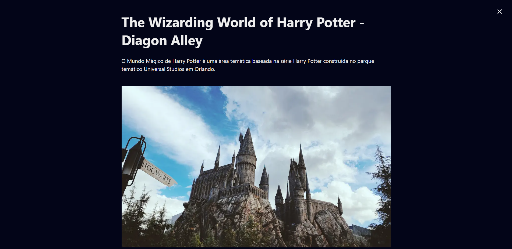

# My Trips

## About the project

Hello how are you? :D
Welcome to My Trips, this is a project I developed for the purpose of studying with React, Next and GraphQL Stacks. The project consists of an application where I can mark on the map places I have already visited and places I would like to visit, a page to access information about each location and a page talking a little about the application.

For development, in addition to the stacks that were mentioned before, some libraries were also used to assist in development, such as [Leaflet](https://leafletjs.com/), [React Leaflet](https://react-leaflet.js.org/), [MapBox](https://www.mapbox.com/) and [GraphCMS](https://hygraph.com/).

With the development of this application I managed to put into practice the development of a PWA, a better SEO configuration with Next, and also train concepts of page architecture and properties with SSR.

# Application pages exemple
 

## Home Page

On the home page there is a map where there are blue and red markers, demarcating places that I have already visited and places that I would like to visit. We also have a legend where it indicates what each color of the paths indicates.
We can also find in the upper right corner a button that takes us to the about page.
 
 

 
 

## Place Page

When we click on any of the markers found on the Home, we are redirected to the Places page, on this page the name of the place will be presented, a small paragraph talking about it, and a compilation of photos of the place.
 
 

 
 

## About Page

This page is just a page explaining a little about what the application is.
 
 

 
 

# About some tools that were used to build the application:
For the correct functioning of the application, some third-party tools were used, such as:

## [GraphCMS](https://hygraph.com/)
GraphCMS was used as the "database" of the application, it is through it that we can dynamically search the pages of the application, the map markers and also the information about each place marked on the map. The requests made to GrapgCMS are graphQL requests, thus helping to avoid over-fetching information on new pages.
 
 

## [Leaflet](https://leafletjs.com/)/[React Leaflet](https://react-leaflet.js.org/),
The Leaflet/React Leaftlet was used to have a better integration with the map in the application. With it it was possible to add the map and control its settings in a much more practical and simple way.
 
 

## [MapBox](https://www.mapbox.com/)

MapBox was used to make the customized construction of the map, through it it was possible to make a very complete customization of the entire map, in a simple and easy way and it also provides us with a way to share the map in a safe way.
 
 
# Access this App:
You can also access this application through the link: https://my-trips-rouge.vercel.app/
